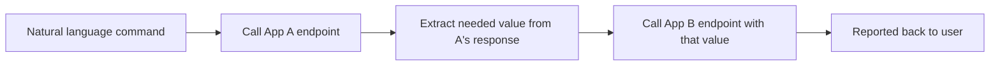

# readme-runtime

readme-runtime is a single-operator agent deployment pattern for people already using Claude Code. It turns a single markdown file into a tool schema and a Claude Code session into the runtime that reads it. Getting it running does not involve standing up a service, implementing a protocol, or building a separate application. If Claude Code already sits in your workflow, this approach adds a working agent for a REST API in about the time it takes to write one file.

It fits internal tools, personal automation, and natural language task initiation against systems you already control, rather than a customer facing product serving many isolated users from one session.

## Lineage

This pattern is a derivative of the [Interpretable Context Methodology (ICM)](https://github.com/RinDig/Interpretable-Context-Methodology), which treats folder structure as agent architecture: a stage contract format (Inputs, Process, Outputs), canonical sources for shared facts, and lightweight checks before an action fires. readme-runtime narrows that methodology to a single, quickly deployable case: one folder, one README, one REST API, running on infrastructure a Claude Code user already has.

The underlying argument, laid out by the ICM creator in a walkthrough of file trees as agent architecture ([source](https://www.youtube.com/shorts/tbVtt2-qUJo)), is that most agent frameworks (LangChain, the Anthropic Agent SDK used as a router, Semantic Kernel, and others in that category) solve a routing problem a file tree already solves on its own. readme-runtime sits at the flat end of that same claim: one folder holds one README, and inside that single file the instructions, tool surface, and guardrails appear as sections rather than as separate subfolders, pointed at one REST API.

## Why this approach

Four properties make this worth choosing over building a dedicated agent:

- **Low maintenance.** The runtime is a Claude Code session and the schema is a markdown file. There is nothing to patch, redeploy, or keep updated beyond editing the README when the API changes.
- **Existing infrastructure.** Anyone with Claude Code already has the runtime. Add a cheap always-on host with tmux keeping the session alive, and Remote Control on top of that, and Claude's own desktop and mobile app become the way you check in on and manage each agent, with no separate app to build or install. Setup details are below.
- **Quick to deploy.** Standing up a new integration means copying a template, filling in the endpoints, and starting a session in that folder. A first working version is achievable in one sitting.
- **Durable against model updates.** Custom orchestration code competes directly with the model vendor's own roadmap, so a feature update can obsolete the whole framework built on top of it. A folder absorbs that same kind of update instead. When a vendor turns some piece of routing into a native model capability, that capability becomes a new tool or subtask node inside the same folder, rather than a reason to rebuild.

The trade is reach — see Limitations below.

## Is this a low-tech MCP?

In spirit, yes. The README takes the place of a tool schema, and the Claude Code session takes the place of a client that reads that schema and calls the API on the user's behalf. That is the same basic shape as MCP: a description of a tool surface, paired with a runtime that acts on it.

Instead of engineering the protocol, discovery, and registry that MCP requires, readme-runtime substitutes three lighter stand-ins: prose parsed directly into an HTTP request in place of a described call, folder convention in place of a discovery mechanism (the runtime finds the schema because it happens to sit in the folder where the session started), and a risk tier plus a checklist written in markdown in place of a typed registry. A model inferring the right call from prose is a weaker guarantee than a client invoking a described tool, and that gap is the price of skipping the engineering MCP requires.

## Folders as dispatch rooms

Think of each folder as a dispatch room: a small office with one job, receiving natural language requests and routing them to the right endpoint. A dispatch room can be scoped two ways.

**Single app.** One dispatch room, one README, one set of endpoints. A request arrives, the room matches it against its own schema, and it dispatches the call. This is the default case covered in TEMPLATE.md.

**Multi app workflow.** A dispatch room can also hold instructions for a short workflow across more than one app's endpoints, for tasks that genuinely span systems. The README for that room states the sequence plainly, for example:

```
Do A: call App A's endpoint to fetch the current value.
Use the result from A as an input to the next step.
Query B: call App B's endpoint with that value, then return B's response to the user.
```

The room still respects each app's own scope and guardrails, and simply carries the connective instructions for how the steps chain together.

This is also the mechanism behind one underlying model taking on different agents: pointing the same Claude Code runtime at a different dispatch room, with a different README, produces a different scoped behavior. It is the same idea ICM applies at the folder level, adapted here to a single, quickly deployable REST case.

## Workflow

Inside one dispatch room, a command moves through the folder's schema, a risk tier branch, and (for mutating calls) one or two gates before it ever reaches the app:


When a dispatch room chains a workflow across apps, the same loop repeats per step, with the output of one call feeding the next:



## What you need

- A host that can stay running. A small, cheap instance is enough, since the runtime is only a CLI process and a terminal multiplexer.
- Claude Code installed and signed in on that host.
- tmux, or an equivalent way to keep a session alive between visits.
- Remote Control turned on and linked to your account, so desktop and mobile can reach a session without shelling in.
- One folder per app, each holding its own filled-out README.
- Credentials for each app's API, stored in that folder's local environment, kept out of the README file itself.
- Optionally, a supervisor such as systemd, if the host needs to survive a reboot without manual restarts.

## How to set up

### The schema

Copy TEMPLATE.md into a new folder as README.md and fill in every section for that app:

- **Auth.** The header and where its value lives.
- **Canonical sources.** Which file owns which fact, so nothing is defined twice.
- **Scope and allowlist.** Only endpoints listed here are callable. Everything else in the upstream API is out of reach by default, regardless of how a request is phrased.
- **Endpoints.** For each one, its Inputs, Process, and Outputs, plus its risk tier.

### The guardrails

Every endpoint carries one of three risk tiers, and the tier decides what must happen before a call fires.

- **Read only.** Fires directly, with no gate.
- **Reversible mutating.** Passes through a shared checklist (target matches, amount or direction matches intent, JSON shape matches the Inputs table, values stay within the guardrail bounds, any inferred field gets flagged to the user). A pass fires the request. A fail returns control to the user instead.
- **Irreversible mutating.** Passes through the same checklist, then a separate confirmation gate. The runtime states plainly what will happen and that it cannot be undone, then waits for the user's explicit go-ahead in that turn. This tier never fires on its own, regardless of the checklist result.

Guardrails also cap blast radius (the largest amount or quantity a single call can touch) and rate (the largest number of calls allowed in a given window). A request that would exceed either cap gets treated as irreversible tier, regardless of its usual classification.

Once the README is filled in, start a Claude Code session in that folder, ask it to read the README, and test with one read-only call and one mutating call before trusting it for real use.

## Limitations

This pattern is single-operator by design, and that's a structural property, not a missing feature to configure around.

- **Remote Control is you, not a channel.** RC gives you remote access to a specific, already-running Claude Code session tied to your own account — it's your agent, reachable by you, from another device. It has no concept of routing an inbound message from someone else into a scoped session; there's no per-sender identity, no allowlist, nothing that lets a third party reach the runtime at all. Access to the folder means access to everything that session's README permits.
- **No built-in path for many isolated users sharing one deployment.** One folder, one session, one operator. Serving multiple external users each with their own scope and credentials — a customer-facing product rather than a personal tool — isn't something this pattern does on its own.
- **The fix is a separate layer, not a variant of this pattern.** A gateway service (chat-channel ingestion, per-sender routing, isolated per-client tool sets and credentials) can sit in front of a folder and add both multi-user reach and non-terminal access, but that's a distinct piece of infrastructure this pattern hands off to — not something readme-runtime itself grows into.

## Roadmap

- Support multiple users — via a gateway layer per Limitations above, not a change to the folder/README pattern itself.
